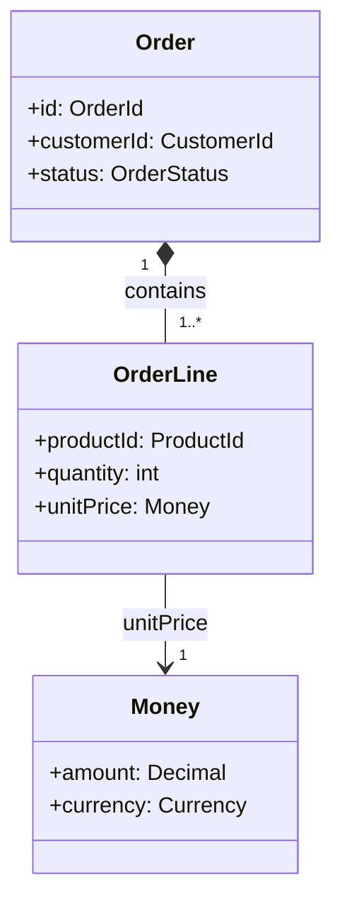

# 階段 3:OOA Class Diagram(結構,先不寫方法)

## 目的

把階段 2 定案的 Aggregate/Entity/VO 轉成正式的類別結構圖:屬性、型別、類別之間的關聯與基數。這階段刻意不寫方法(behavior)——先讓使用者確認「形狀對不對」,再進階段 4 補行為。太早把方法一起畫,常常會讓使用者在確認結構時分心去想邏輯細節。

## 該問的問題

1. 對每個 Entity/VO,問:「這個東西需要記錄哪些屬性?」——只收斂到「業務上有意義」的屬性,不要自己補資料庫技術欄位(如 created_at、updated_at)除非使用者主動提到。
2. 對 Aggregate 內的關聯,問:「一個 <Root> 最多可以有幾個 <成員>?可以是 0 個嗎?」——確認基數(multiplicity),常見型態:
   - `1 --> 1`:必須恰好一個
   - `1 --> 0..1`:可選,最多一個
   - `1 --> 0..*`:可選,任意多個
   - `1 --> 1..*`:至少一個,可多個
3. 對 Aggregate 之間的參照,確認是用 ID 參照(畫成備註或屬性,例如 `+customerId: CustomerId`),不要畫成物件關聯箭頭——這樣才不會在圖上暗示可以跨 Aggregate 直接持有物件引用。
4. 如果同一個屬性在不同 Entity 上重複出現(例如 Order 跟 Invoice 都有「金額」),問:「這幾個地方的『金額』,規則(例如貨幣、精度)是不是一樣?」——一樣的話,考慮抽成獨立的 Value Object 類別重複使用,而不是到處複製欄位。

## Mermaid classDiagram 語法速查

- `*--` 表示組合(Composition,生命週期綁死在一起,Aggregate 內部關係常用這個)
- `-->` 表示一般關聯/參照
- 標籤(`: contains`)寫清楚關聯的業務意義,不是只畫線

## 輸出格式

一個 mermaid `classDiagram` code block,涵蓋這次建模範圍內所有的 Aggregate(每個 Aggregate 可以用註解或分隔標明邊界)。屬性只寫型別,不寫方法(方法留給階段 4)。

## 停止條件

使用者看過圖,確認「這些類別、屬性、關聯基數都對」,才進階段 4。如果使用者說某個關聯基數想錯了,回去修正——這通常代表階段 2 的 Aggregate 邊界也要跟著檢查一次,不是只改圖上的線。
