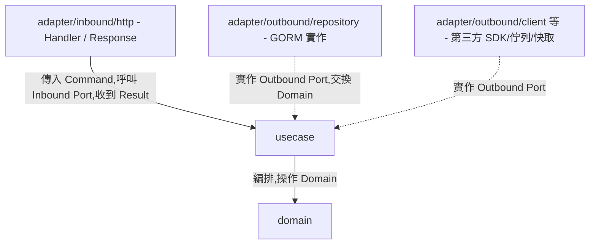

# Architecture — 依賴規則、Package 結構與命名推導

所有層共用的規範。產生任何程式碼前先讀本文件。

## 規則

1. 依賴方向由外向內:`adapter`(Interface Adapters,含 inbound/outbound 兩側)→ `usecase` → `domain`;內層對外層零依賴。
2. Adapter/Outbound 透過「實作 Usecase 的 Outbound Port」與內層連接;Adapter/Inbound 透過「呼叫 Inbound Port」與內層連接——Go 沒有 `implements` 關鍵字,靠 struct 的方法集合結構性滿足介面,每個實作檔案仍須放一行編譯期檢查 `var _ port.XxxPort = (*XxxImpl)(nil)`,讓「這個 struct 實作了哪個 port」在原始碼中顯式可見。
3. 所有 package 路徑與型別名稱依本文件的結構與推導表產生。
4. Module path 為 `<basePackage>`(用戶未提供時使用 `github.com/example/<project>`);所有程式碼放在 `internal/` 之下,禁止外部 module 匯入(Go 語言層級強制)。
5. Domain 物件(及其業務方法)只在 `domain`、`usecase`、`adapter/outbound/repository`(Repository Port 本來就是 `Save(ctx, *Entity) (*Entity, error)` 這種簽名,Mapper 也要做 Domain ↔ DataModel 轉換,合理接觸 Domain)之間流動;但**跨到 `adapter/inbound` 一律不行**——Inbound Port 回傳的必須是 Usecase 自己定義的 `<Entity>Result` 家族型別(見 `references/usecase_layer.md` 規則 9),Handler/Response 不 import `domain` package。
6. **一個 use case 情境一個 Inbound Port + 一個 Impl**,不用一個大介面/大 struct 涵蓋整個 entity 的所有動作(見 `references/usecase_layer.md` 規則 2、10)。
7. **`<Action>Command` 跟 `<Entity>Result` 一樣定義在 `usecase` 層**(見 `references/usecase_layer.md` 規則 11),不是 Adapter/Inbound 自己的型別——Command 是輸入邊界、Result 是輸出邊界,兩者對稱,都由 Usecase 擁有;Adapter/Inbound 的 Handler 只是 import 使用。
8. 每個對外方法(port 介面方法、usecase 方法、repository 方法)第一個參數固定是 `context.Context`;唯獨 Domain 層方法不帶 `context.Context`(Domain 是純運算,不做 I/O,見 `references/domain_layer.md` 規則 1)。
9. **錯誤用 `error` 回傳值表達,不用 panic**:業務規則違反、找不到資料都回傳具名錯誤(見規則 10),呼叫端用 `errors.Is` / `errors.As` 判斷種類;只有無法恢復的程式錯誤(如 nil pointer 誤用)才允許 panic,產生的程式碼不應該出現這種情況。

## 共用基礎設施(每個專案只生成一次)

Go 沒有例外階層,`errors.New` 產生的錯誤彼此不具備可辨識的型別,因此需要兩個極小的共用套件,讓 HTTP 層能用 `errors.Is`/`errors.As` 統一判斷錯誤種類、對應到正確的 HTTP 狀態碼。**這兩個套件與 middleware 只在專案第一次使用本 skill 時產生一次,後續每個 entity 重複使用,不要每次都重新產生。**

```
internal/
├── domain/
│   └── domainerr/
│       └── domainerr.go       # domain 層共用的 sentinel error(狀態/參數不合法)
├── usecase/
│   └── usecaseerr/
│       └── not_found.go       # usecase 層共用的 NotFoundError,所有 entity 共用同一個型別
├── adapter/inbound/http/middleware/
│   └── error_handler.go       # 全域錯誤轉 HTTP 狀態碼的 middleware
└── testsupport/
    └── mariadb.go              # Handler e2e 測試共用:啟動 MariaDB testcontainer、AutoMigrate、回傳 *gorm.DB
```

`domainerr` 放在 `domain/` 底下、`usecaseerr` 放在 `usecase/` 底下(而不是與 `domain`/`usecase` 平行的頂層目錄),讓目錄結構直接標示出每個錯誤套件屬於哪一層,呼應 `usecase/<entity>/` 底下已有的 `port/`、`result/` 等子目錄慣例;兩者子套件名稱(`domainerr`、`usecaseerr`)與父目錄套件名稱(`domain`、`usecase`)不同,不會有 import 識別碼衝突。`testsupport` 是純測試用的基礎設施,不屬於任何一個 production 層,所以維持跟 `domain`/`usecase`/`adapter` 平行的頂層目錄,供每個 entity 的 Handler e2e 測試共用。

### `internal/domain/domainerr/domainerr.go`

```go
// Package domainerr defines sentinel errors shared by every entity's domain layer.
package domainerr

import "errors"

var (
	// ErrInvalidState is wrapped by domain methods when a business rule rejects
	// the entity's current state.
	ErrInvalidState = errors.New("invalid state")

	// ErrInvalidArgument is wrapped by domain constructors when an input value
	// violates an invariant.
	ErrInvalidArgument = errors.New("invalid argument")
)
```

### `internal/usecase/usecaseerr/not_found.go`

```go
// Package usecaseerr defines error types shared by every entity's usecase layer.
package usecaseerr

import "fmt"

// NotFoundError is returned by usecase methods when a looked-up entity does not
// exist. It is shared by every entity instead of each defining its own type.
type NotFoundError struct {
	Entity string
	ID     any
}

func (e *NotFoundError) Error() string {
	return fmt.Sprintf("%s not found for id: %v", e.Entity, e.ID)
}
```

### `internal/adapter/inbound/http/middleware/error_handler.go`

```go
// Package middleware holds cross-cutting Gin middleware shared by every entity's handlers.
package middleware

import (
	"errors"
	"net/http"

	"github.com/gin-gonic/gin"
	"github.com/go-playground/validator/v10"

	"<basePackage>/internal/domain/domainerr"
	"<basePackage>/internal/usecase/usecaseerr"
)

// ErrorHandler centralizes error-to-status-code translation so individual
// handlers never branch on error type themselves.
func ErrorHandler() gin.HandlerFunc {
	return func(c *gin.Context) {
		c.Next()

		if len(c.Errors) == 0 {
			return
		}
		err := c.Errors.Last().Err

		var notFound *usecaseerr.NotFoundError
		var validationErrs validator.ValidationErrors

		switch {
		case errors.As(err, &notFound):
			c.JSON(http.StatusNotFound, gin.H{"error": err.Error()})
		case errors.As(err, &validationErrs):
			c.JSON(http.StatusBadRequest, gin.H{"error": err.Error()})
		case errors.Is(err, domainerr.ErrInvalidState), errors.Is(err, domainerr.ErrInvalidArgument):
			c.JSON(http.StatusBadRequest, gin.H{"error": err.Error()})
		default:
			c.JSON(http.StatusInternalServerError, gin.H{"error": "internal server error"})
		}
	}
}
```

Handler 呼叫 use case 出錯時一律 `c.Error(err); return`,不自己組 JSON、不自己決定狀態碼——`ErrorHandler()` 在 router 上全域註冊一次(`router.Use(middleware.ErrorHandler())`),統一攔截。

### `internal/testsupport/mariadb.go`

Handler 的 e2e 測試(見 `references/adapter_inbound_layer.md`)要串起真實的 Usecase + Repository,需要一個真實資料庫,而不是每個 entity 各自寫一次 testcontainer 啟動邏輯,所以跟 `domainerr`/`usecaseerr` 一樣抽成專案級共用檔案:

```go
//go:build integration

// Package testsupport holds shared integration-test infrastructure reused by every
// entity's Handler e2e test, so each test doesn't reimplement container bootstrap.
package testsupport

import (
	"context"
	"testing"

	tcmariadb "github.com/testcontainers/testcontainers-go/modules/mariadb"
	"gorm.io/driver/mysql"
	"gorm.io/gorm"
)

// NewMariaDBTestDB starts a disposable MariaDB container, connects GORM to it,
// runs AutoMigrate for the given DataModels, and terminates the container when the
// test ends (via t.Cleanup) — the caller never manages container lifecycle itself.
func NewMariaDBTestDB(t *testing.T, models ...any) *gorm.DB {
	t.Helper()
	ctx := context.Background()

	container, err := tcmariadb.Run(ctx, "mariadb:11",
		tcmariadb.WithDatabase("testdb"),
		tcmariadb.WithUsername("test"),
		tcmariadb.WithPassword("test"),
	)
	if err != nil {
		t.Fatalf("start mariadb container: %v", err)
	}
	t.Cleanup(func() { _ = container.Terminate(ctx) })

	dsn, err := container.ConnectionString(ctx, "parseTime=true")
	if err != nil {
		t.Fatalf("get mariadb connection string: %v", err)
	}

	db, err := gorm.Open(mysql.Open(dsn), &gorm.Config{})
	if err != nil {
		t.Fatalf("connect gorm to mariadb: %v", err)
	}
	if err := db.AutoMigrate(models...); err != nil {
		t.Fatalf("automigrate: %v", err)
	}
	return db
}
```

用 MariaDB 是因為這是專案實際使用的正式環境資料庫;若之後專案改用別的 SQL 資料庫,把 image 與 driver 換成對應的 testcontainers 模組即可,`NewMariaDBTestDB` 的介面形狀不用變。這個檔案跟它啟動的 container 只服務 `-tags=integration` 測試,不影響 `go test ./...` 預設跑的單元測試(不需要 Docker)。

需要真實外部服務(Redis、Kafka 等)的 entity,依同樣模式在 `testsupport/` 下新增對應檔案(如 `redis.go`),第一次有 entity 用到該類服務時產生,之後重用,不重複產生;哪些外部依賴有對應的 testcontainers 模組、哪些該直接 mock,見 `references/adapter_inbound_layer.md` 的對照表。



## 與 Clean Architecture 四圈的對應

| 本文件層名 | Uncle Bob 原始四圈 |
|---|---|
| `domain` | 第一圈 Entities |
| `usecase` | 第二圈 Use Cases |
| `adapter`(outbound + inbound) | 第三圈 Interface Adapters(Repository 是 outbound 側,Handler/Presenter 是 inbound 側) |
| *(無獨立 package)* | 第四圈 Frameworks & Drivers — Gin、GORM/DB driver、HTTP server 本身;實務上內嵌於 adapter 層的框架呼叫中,不另立目錄 |

## Package 結構

```
<basePackage>/                                  # go.mod module path
├── internal/
│   ├── domain/
│   │   ├── domainerr/                           # 共用,見上節
│   │   │   └── domainerr.go
│   │   └── <entity>/                            # package domain
│   │       ├── <entity>.go                      # 核心領域實體 + New<Entity> 建構子
│   │       ├── status.go                        # 狀態型別(如適用)
│   │       └── <concept>.go                     # 策略介面(如適用)
│   │
│   ├── usecase/
│   │   ├── usecaseerr/                          # 共用,見上節
│   │   │   └── not_found.go
│   │   └── <entity>/                            # package usecase(root 檔案)
│   │       ├── <action>_<entity>.go              # 一個 use case 情境一個檔案
│   │       ├── get_<entity>.go                   # 查詢型 use case,同樣直接放在此目錄下
│   │       ├── port/                             # package port — 所有介面(Inbound + Outbound Port)
│   │       │   ├── <action>_<entity>_usecase.go  # Inbound Port,一個 use case 情境一個(回傳 Result,不回傳 Domain)
│   │       │   ├── <entity>_repository.go        # Outbound Port — 資料庫抽象
│   │       │   ├── <concept>_client.go           # Outbound Port — 外部 API/SDK 抽象(如適用)
│   │       │   ├── <concept>_message_publisher.go
│   │       │   ├── <concept>_cache_store.go
│   │       │   ├── <concept>_notification_sender.go
│   │       │   ├── <concept>_file_storage.go
│   │       │   └── domain_event_publisher.go     # Outbound Port — 事件發送抽象
│   │       ├── result/                           # package result — Usecase 輸出型別(struct,無業務方法)
│   │       │   ├── <entity>_result.go
│   │       │   └── <entity>_summary_result.go    # 列表/精簡查詢用(如適用)
│   │       ├── command/                          # package command — Usecase 輸入型別,與 result/ 對稱
│   │       │   └── <action>_command.go
│   │       └── event/                            # package event — 領域事件
│   │           └── <entity>_<action>_event.go
│   │
│   ├── adapter/                                  # Interface Adapters(第三圈)
│   │   ├── outbound/
│   │   │   ├── repository/
│   │   │   │   ├── datamodel/<entity>_data_model.go  # package datamodel — GORM 持久化物件
│   │   │   │   ├── mapper/<entity>_mapper.go         # package mapper — 雙向對映(純函式)
│   │   │   │   └── <entity>_repository.go            # package repository — Outbound Port 實作
│   │   │   ├── client/<provider>_<concept>_adapter.go       # package client(如適用)
│   │   │   ├── messaging/<provider>_<concept>_adapter.go    # package messaging(如適用)
│   │   │   ├── cache/<provider>_<concept>_adapter.go        # package cache(如適用)
│   │   │   ├── notification/<provider>_<concept>_adapter.go # package notification(如適用)
│   │   │   ├── storage/<provider>_<concept>_adapter.go      # package storage(如適用)
│   │   │   └── event/in_process_event_publisher.go          # package event
│   │   │
│   │   └── inbound/
│   │       ├── http/
│   │       │   ├── <entity>/                     # package <entity> ——例外:見下方命名表註記
│   │       │   │   ├── handler.go                # type Handler,呼叫 usecase 層的 Inbound Port
│   │       │   │   └── response.go                # type Response
│   │       │   └── middleware/error_handler.go    # 共用,見上節
│   │       └── router.go                          # 組裝所有 entity 的路由(composition root 的一部分)
│   │
│   └── testsupport/                              # 共用,見上節;Handler e2e 測試用
│       └── mariadb.go
│
├── cmd/
│   └── server/main.go                            # composition root:建立 *gorm.DB、組裝所有依賴、啟動 Gin
└── go.mod
```

## 命名推導表(Entity = `Booking` 為例)

| 概念 | Package | 型別/識別符 | 檔案路徑 |
|---|---|---|---|
| Domain 實體 | `domain` | `Booking`、`NewBooking(...) (*Booking, error)` | `internal/domain/booking/booking.go` |
| Domain 狀態型別 | `domain` | `Status`(`type Status string` + `const` 列舉值) | `internal/domain/booking/status.go` |
| Domain 策略介面 | `domain` | `<Concept>` | `internal/domain/booking/<concept>.go` |
| UseCase Inbound Port(一個 use case 一個) | `port` | `CreateBookingUseCase`、`ConfirmBookingUseCase`、`GetBookingUseCase` | `internal/usecase/booking/port/create_booking_usecase.go` 等 |
| UseCase 實作(一個 use case 一個) | `usecase` | `CreateBookingUseCaseImpl`、`NewCreateBookingUseCaseImpl(...)` | `internal/usecase/booking/create_booking.go` 等 |
| UseCase 輸出型別(detail) | `result` | `BookingResult`、`NewBookingResultFrom(*domain.Booking) BookingResult` | `internal/usecase/booking/result/booking_result.go` |
| UseCase 輸出型別(summary/list) | `result` | `BookingSummaryResult` | `internal/usecase/booking/result/booking_summary_result.go` |
| UseCase 輸入型別(command) | `command` | `CreateBookingCommand` | `internal/usecase/booking/command/create_booking_command.go` |
| Outbound Port — DB | `port` | `BookingRepository` | `internal/usecase/booking/port/booking_repository.go` |
| Outbound Port — 外部 API/SDK | `port` | `<Concept>Client` | `internal/usecase/booking/port/<concept>_client.go` |
| Outbound Port — 訊息佇列 | `port` | `<Concept>MessagePublisher` | `internal/usecase/booking/port/<concept>_message_publisher.go` |
| Outbound Port — 快取 | `port` | `<Concept>CacheStore` | `internal/usecase/booking/port/<concept>_cache_store.go` |
| Outbound Port — 通知 | `port` | `<Concept>NotificationSender` | `internal/usecase/booking/port/<concept>_notification_sender.go` |
| Outbound Port — 檔案儲存 | `port` | `<Concept>FileStorage` | `internal/usecase/booking/port/<concept>_file_storage.go` |
| 領域事件 | `event` | `BookingConfirmedEvent` | `internal/usecase/booking/event/booking_confirmed_event.go` |
| GORM DataModel | `datamodel` | `BookingDataModel` | `internal/adapter/outbound/repository/datamodel/booking_data_model.go` |
| Mapper | `mapper` | `ToDomain(*datamodel.BookingDataModel) (*domain.Booking, error)`、`ToDataModel(*domain.Booking) *datamodel.BookingDataModel` | `internal/adapter/outbound/repository/mapper/booking_mapper.go` |
| Repository 實作 | `repository` | `BookingRepositoryImpl`、`NewBookingRepositoryImpl(*gorm.DB)` | `internal/adapter/outbound/repository/booking_repository.go` |
| 外部依賴 Adapter(client/messaging/cache/notification/storage 共用) | 依子目錄(`client`/`messaging`/...) | `<Provider><Concept>Adapter` | `internal/adapter/outbound/client/stripe_payment_adapter.go` |
| HTTP Handler | `<entity>`(見下方註記) | `Handler`、`NewHandler(...)` | `internal/adapter/inbound/http/booking/handler.go` |
| Response | `<entity>` | `Response`、`NewResponseFrom(result.BookingResult) Response` | `internal/adapter/inbound/http/booking/response.go` |
| Domain 單元測試(Layer 1) | `domain` | `TestBooking_<BusinessMethod>` | `internal/domain/booking/booking_test.go` |
| Handler e2e 測試(Layer 2,串真實 Usecase + Repository,見 `references/testing_principles.md`) | `<entity>` | `TestHandler_<Method>` | `internal/adapter/inbound/http/booking/handler_test.go` |

**命名例外**:`domain`、`usecase`、`port`、`result`、`command`、`event`、`datamodel`、`mapper`、`repository` 這些 package 名稱在每個 entity 底下重複出現(靠目錄路徑,不是靠 package 名稱,區分不同 entity),同一個檔案通常只會 import 到其中一個 entity 的這些 package,不會撞名。但 `adapter/inbound/http/<entity>/` 這一層改用 **entity 名稱本身**當 package 名(如 `package booking`),不叫 `package http`——因為這一層的檔案幾乎必定同時 `import "net/http"`,若 package 也叫 `http` 會撞名。也因此,這個 package 內的型別**不重複加 entity 前綴**(`booking.Handler`、`booking.Response`,不是 `booking.BookingHandler`),避免 stutter。

## 輸入格式

```
Entity: <實體名稱,PascalCase>
Fields:
  - <fieldName> (<Go 型別>) [<說明,選填>]
Business Rules:
  - <methodName>(): <業務規則描述>
Outbound Dependencies:
  - <InterfaceName>: <用途說明>
API Endpoints:
  - <HTTP Method> <path>: <說明>
Tests: (選填 — 提供時先產測試再產實作)
  - <測試情境描述>
```
