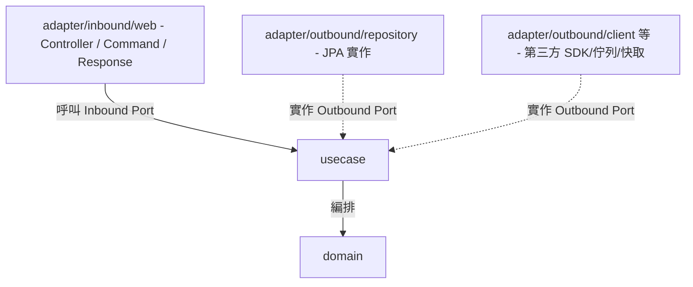

# Architecture — 依賴規則、Package 結構與命名推導

所有層共用的規範。產生任何程式碼前先讀本文件。

## 規則

1. 依賴方向由外向內:`adapter`(Interface Adapters,含 inbound/outbound 兩側)→ `usecase` → `domain`;內層對外層零依賴。
2. Adapter/Outbound 透過「實作 Usecase 的 Outbound Port」與內層連接;Adapter/Inbound 透過「呼叫 Inbound Port」與內層連接。
3. 所有 package 路徑與類別名稱依本文件的結構與推導表產生。
4. Base package 為 `<basePackage>`(用戶未提供時使用 `com.example.<project>`)。



## 與 Clean Architecture 四圈的對應

| 本文件層名 | Uncle Bob 原始四圈 |
|---|---|
| `domain` | 第一圈 Entities |
| `usecase` | 第二圈 Use Cases |
| `adapter`(outbound + inbound) | 第三圈 Interface Adapters(Gateway/Repository 是 outbound 側,Controller/Presenter 是 inbound 側) |
| *(無獨立 package)* | 第四圈 Frameworks & Drivers — Spring Boot、JPA/DB driver、HTTP server 本身;實務上內嵌於 adapter 層的框架註解與函式庫呼叫中,不另立目錄 |

`adapter` 不再用 `application` 這個名字,避免與第四圈的 "Frameworks" 混淆——Controller/Command/Response 屬於 Interface Adapters 的 inbound 側,不是框架本身。

## Package 結構

```
<basePackage>/
├── domain/
│   └── <entity>/
│       ├── <Entity>.java                  # 核心領域實體
│       ├── <Entity>Status.java            # 狀態列舉(如適用)
│       └── <Concept>.java                 # 策略介面(如適用)
│
├── usecase/
│   └── <entity>/
│       ├── <Entity>UseCase.java           # Inbound Port(介面)
│       ├── <Entity>UseCaseImpl.java       # UseCase 實作
│       ├── <Entity>Repository.java        # Outbound Port — 資料庫抽象
│       ├── <Concept>Client.java           # Outbound Port — 外部 API/SDK 抽象(如適用)
│       ├── <Concept>MessagePublisher.java # Outbound Port — 訊息佇列抽象(如適用)
│       ├── <Concept>CacheStore.java       # Outbound Port — 快取抽象(如適用)
│       ├── <Concept>NotificationSender.java # Outbound Port — 通知抽象(如適用)
│       ├── <Concept>FileStorage.java      # Outbound Port — 檔案儲存抽象(如適用)
│       ├── DomainEventPublisher.java      # Outbound Port — 事件發送抽象
│       ├── <Entity>NotFoundException.java # 領域例外
│       └── event/
│           └── <Entity><Action>Event.java # 領域事件
│
└── adapter/                                   # Interface Adapters(第三圈)
    ├── outbound/                              # 實作 Outbound Port,驅動內層依賴的一側
    │   ├── repository/
    │   │   ├── datamodel/<Entity>DataModel.java  # JPA 持久化物件(@Entity @Table @Column),避免與 Domain 的 <Entity> 混淆
    │   │   ├── mapper/<Entity>Mapper.java     # 雙向對映器(static methods)
    │   │   ├── <Entity>JpaRepository.java     # Spring Data JPA 介面
    │   │   └── <Entity>RepositoryImpl.java    # Outbound Port 實作
    │   ├── client/<Provider><Concept>Adapter.java        # 外部 API/SDK(如適用)
    │   ├── messaging/<Provider><Concept>Adapter.java     # 訊息佇列 producer(如適用)
    │   ├── cache/<Provider><Concept>Adapter.java         # 快取讀寫(如適用)
    │   ├── notification/<Provider><Concept>Adapter.java  # 通知發送(如適用)
    │   ├── storage/<Provider><Concept>Adapter.java       # 檔案/物件儲存(如適用)
    │   └── event/SpringDomainEventPublisher.java
    │
    └── inbound/                               # 呼叫 Inbound Port,被外部驅動的一側
        └── web/
            ├── <entity>/
            │   ├── <Entity>Controller.java    # @RestController
            │   ├── <Action>Command.java       # 寫入型 endpoint 的輸入(不叫 Request/Dto)
            │   └── <Entity>Response.java      # 輸出(不叫 Dto)
            └── exception/GlobalExceptionHandler.java  # @RestControllerAdvice
```

## 命名推導表(Entity = `Booking` 為例)

| 類別 | 命名規則 | 範例 |
|------|----------|------|
| Domain 實體 | `<Entity>.java` | `Booking.java` |
| Domain 列舉 | `<Entity>Status.java` | `BookingStatus.java` |
| Domain 策略介面 | `<Concept>.java` | `Plan.java` |
| UseCase Inbound Port | `<Entity>UseCase.java` | `BookingUseCase.java` |
| UseCase 實作 | `<Entity>UseCaseImpl.java` | `BookingUseCaseImpl.java` |
| Outbound Port — DB | `<Entity>Repository.java` | `BookingRepository.java` |
| Outbound Port — 外部 API/SDK | `<Concept>Client.java` | `PaymentClient.java` |
| Outbound Port — 訊息佇列 | `<Concept>MessagePublisher.java` | `OrderMessagePublisher.java` |
| Outbound Port — 快取 | `<Concept>CacheStore.java` | `BookingCacheStore.java` |
| Outbound Port — 通知 | `<Concept>NotificationSender.java` | `SmsNotificationSender.java` |
| Outbound Port — 檔案儲存 | `<Concept>FileStorage.java` | `AttachmentFileStorage.java` |
| 領域例外 | `<Entity>NotFoundException.java` | `BookingNotFoundException.java` |
| 領域事件 | `<Entity><Action>Event.java` | `BookingConfirmedEvent.java` |
| JPA DataModel | `<Entity>DataModel.java` | `BookingDataModel.java` |
| Mapper | `<Entity>Mapper.java` | `BookingMapper.java` |
| JPA Repository | `<Entity>JpaRepository.java` | `BookingJpaRepository.java` |
| Repository 實作 | `<Entity>RepositoryImpl.java` | `BookingRepositoryImpl.java` |
| 外部依賴 Adapter(client/messaging/cache/notification/storage 共用) | `<Provider><Concept>Adapter.java` | `StripePaymentAdapter.java` |
| REST Controller | `<Entity>Controller.java` | `BookingController.java` |
| Command | `<Action>Command.java` | `ConfirmBookingCommand.java` |
| Response | `<Entity>Response.java` | `BookingResponse.java` |
| Domain 單元測試 | `<Entity>Test.java` | `BookingTest.java` |
| UseCase 單元測試 | `<Entity>UseCaseImplTest.java` | `BookingUseCaseImplTest.java` |

## 輸入格式

```
Entity: <實體名稱,PascalCase>
Fields:
  - <fieldName> (<Java 型別>) [<說明,選填>]
Business Rules:
  - <methodName>(): <業務規則描述>
Outbound Dependencies:
  - <InterfaceName>: <用途說明>
API Endpoints:
  - <HTTP Method> <path>: <說明>
Tests: (選填 — 提供時先產測試再產實作)
  - <測試情境描述>
```
