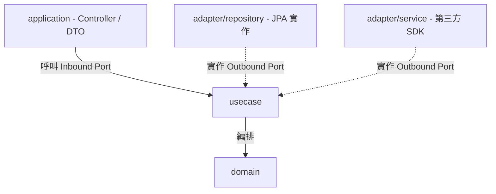

# Architecture — 依賴規則、Package 結構與命名推導

所有層共用的規範。產生任何程式碼前先讀本文件。

## 規則

1. 依賴方向由外向內:`application`/`adapter` → `usecase` → `domain`;內層對外層零依賴。
2. Adapter 透過「實作 Usecase 的 Outbound Port」與內層連接;Application 透過「呼叫 Inbound Port」與內層連接。
3. 所有 package 路徑與類別名稱依本文件的結構與推導表產生。
4. Base package 為 `<basePackage>`(用戶未提供時使用 `com.example.<project>`)。



## Package 結構

```
<basePackage>/
├── domain/
│   └── <entity>/
│       ├── <Entity>.java                  # 核心領域實體
│       ├── <Entity>Status.java            # 狀態列舉(如適用)
│       └── <Concept>.java                 # 策略介面(如適用)
│
├── usecase/
│   └── <entity>/
│       ├── <Entity>UseCase.java           # Inbound Port(介面)
│       ├── <Entity>UseCaseImpl.java       # UseCase 實作
│       ├── <Entity>Repository.java        # Outbound Port — 資料庫抽象
│       ├── <Concept>Service.java          # Outbound Port — 外部服務抽象
│       ├── DomainEventPublisher.java      # Outbound Port — 事件發送抽象
│       ├── <Entity>NotFoundException.java # 領域例外
│       └── event/
│           └── <Entity><Action>Event.java # 領域事件
│
├── adapter/
│   ├── repository/
│   │   ├── entity/<Entity>Entity.java     # JPA 實體(@Entity @Table @Column)
│   │   ├── mapper/<Entity>Mapper.java     # 雙向對映器(static methods)
│   │   ├── <Entity>JpaRepository.java     # Spring Data JPA 介面
│   │   └── <Entity>RepositoryImpl.java    # Outbound Port 實作
│   ├── service/<Provider><Concept>ServiceImpl.java
│   └── event/SpringDomainEventPublisher.java
│
└── application/
    ├── <entity>/
    │   ├── <Entity>Controller.java        # @RestController
    │   └── dto/
    │       ├── <Action>Request.java
    │       └── <Entity>Response.java
    └── exception/GlobalExceptionHandler.java  # @RestControllerAdvice
```

## 命名推導表(Entity = `Booking` 為例)

| 類別 | 命名規則 | 範例 |
|------|----------|------|
| Domain 實體 | `<Entity>.java` | `Booking.java` |
| Domain 列舉 | `<Entity>Status.java` | `BookingStatus.java` |
| Domain 策略介面 | `<Concept>.java` | `Plan.java` |
| UseCase Inbound Port | `<Entity>UseCase.java` | `BookingUseCase.java` |
| UseCase 實作 | `<Entity>UseCaseImpl.java` | `BookingUseCaseImpl.java` |
| Outbound Port — DB | `<Entity>Repository.java` | `BookingRepository.java` |
| Outbound Port — 外部服務 | `<Concept>Service.java` | `NotificationService.java` |
| 領域例外 | `<Entity>NotFoundException.java` | `BookingNotFoundException.java` |
| 領域事件 | `<Entity><Action>Event.java` | `BookingConfirmedEvent.java` |
| JPA 實體 | `<Entity>Entity.java` | `BookingEntity.java` |
| Mapper | `<Entity>Mapper.java` | `BookingMapper.java` |
| JPA Repository | `<Entity>JpaRepository.java` | `BookingJpaRepository.java` |
| Repository 實作 | `<Entity>RepositoryImpl.java` | `BookingRepositoryImpl.java` |
| 外部服務實作 | `<Provider><Concept>ServiceImpl.java` | `StripePaymentServiceImpl.java` |
| REST Controller | `<Entity>Controller.java` | `BookingController.java` |
| Request DTO | `<Action>Request.java` | `CreateBookingRequest.java` |
| Response DTO | `<Entity>Response.java` | `BookingResponse.java` |
| Domain 單元測試 | `<Entity>Test.java` | `BookingTest.java` |
| UseCase 單元測試 | `<Entity>UseCaseImplTest.java` | `BookingUseCaseImplTest.java` |

## 輸入格式

```
Entity: <實體名稱,PascalCase>
Fields:
  - <fieldName> (<Java 型別>) [<說明,選填>]
Business Rules:
  - <methodName>(): <業務規則描述>
Outbound Dependencies:
  - <InterfaceName>: <用途說明>
API Endpoints:
  - <HTTP Method> <path>: <說明>
Tests: (選填 — 提供時先產測試再產實作)
  - <測試情境描述>
```
