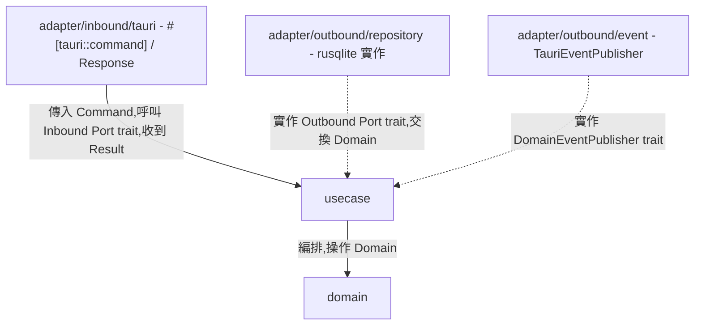

# Architecture — 依賴規則、Module 結構與命名推導

所有層共用的規範。產生任何程式碼前先讀本文件。

## 規則

1. 依賴方向由外向內:`adapter`(Interface Adapters,含 outbound/inbound 兩側)→ `usecase` → `domain`;內層對外層零依賴。
2. Adapter/Outbound 透過「實作 Usecase 的 Outbound Port trait」與內層連接;Adapter/Inbound 透過「呼叫 Inbound Port trait」與內層連接。
3. 所有 module 路徑與型別名稱依本文件的結構與推導表產生。
4. Crate 根目錄為 `<crateRoot>`,Tauri 專案固定為 `src-tauri/src`(使用者未指明時直接假設是 Tauri 專案,因為本 skill 的 inbound adapter 固定產出 `#[tauri::command]`,不是通用 HTTP handler)。
5. Domain 型別(及其業務方法)只在 `domain`、`usecase`、`adapter/outbound`(Repository trait 本來就是 `fn save(&self, booking: Booking) -> Result<Booking, AppError>` 這種簽名,Mapper 也要做 Domain ↔ DataModel 轉換,合理接觸 Domain)之間流動;但**跨到 `adapter/inbound` 一律不行**——Inbound Port 回傳的必須是 Usecase 自己定義的 `<Entity>Result` 家族型別(見 `references/usecase_layer.md`),Tauri command 函式與 Response struct 不 import `domain` module。
6. **一個 use case 情境一個 Inbound Port trait + 一個 Impl struct**,不用一個大 trait/大 struct 涵蓋整個 entity 的所有動作。
7. **`<Action>Command`/`<Entity>Result` 定義在 `usecase` 層**,不是 Adapter/Inbound 自己的型別——Command 是輸入邊界、Result 是輸出邊界,兩者對稱,都由 Usecase 擁有;Adapter/Inbound 的 `#[tauri::command]` 函式只是 import 使用。這兩種型別是本專案唯一需要 derive `serde::Serialize`/`Deserialize` 的地方,因為 Tauri IPC 底層用 serde 做 JSON 序列化(對應 Java 的 Jackson、Go 的 Gin binding,但這裡是語言/框架邊界的必然需求,不是額外選擇)。
8. **錯誤是專案級共用型別,不是每個 entity 各自定義**:`AppError`(`thiserror::Error` derive)只在整個專案第一次使用本 skill 時產生一次,之後每個新 entity 直接重用其中的 `NotFound`、`InvalidState`、`InvalidArgument`、`Db` 等 variant,不重複定義。這比 Java 常見的「每個 entity 一個 `<Entity>NotFoundException`」更貼近 Rust 生態的慣例(標準函式庫與主流 crate 幾乎都用少數幾個共用的 error enum,搭配 `thiserror` 的 `#[error("...")]` 訊息與 `#[from]` 轉換,而不是滿地開自訂例外類別)。



## 與 Clean Architecture 四圈的對應

| 本文件層名 | Uncle Bob 原始四圈 |
|---|---|
| `domain` | 第一圈 Entities |
| `usecase` | 第二圈 Use Cases |
| `adapter`(outbound + inbound) | 第三圈 Interface Adapters(Repository 是 outbound 側,Tauri command 是 inbound 側) |
| *(無獨立 module)* | 第四圈 Frameworks & Drivers — Tauri runtime、rusqlite/SQLite driver 本身;實務上內嵌於 adapter 層的 `#[tauri::command]` 巨集與函式庫呼叫中,不另立目錄 |

這是 `java-clean-arch-codegen` / `go-clean-arch-codegen` 的 Rust 版本,分層概念與命名推導邏輯一致,差異只在語言慣用法——Rust 沒有例外(用 `Result<T, E>`)、沒有繼承(用 trait)、沒有 GC 保證(依賴以 `Arc`/`&` 明確傳遞)。技術選型固定為 **Tauri v2**(inbound)+ **rusqlite**(outbound persistence)+ **thiserror**(錯誤)+ **mockall**(僅第三方 SaaS Client 需要時的測試替身,見 `references/testing_principles.md`),確保多次產出結果高度一致,且是這個技術棧下慣用的 Rust 寫法,不是 Java/Go 語法的機械翻譯。

## Module 結構(以 Entity = `Booking` 為例)

Rust module 檔案採傳統 `mod.rs`慣例:每個目錄一個 `mod.rs` 負責 `pub mod <child>;` 宣告與(如適用)該層級自己的型別定義,讓目錄結構本身就能一眼看出這個 entity 有哪些 use case、哪些 port,不必逐一開檔案。

```
<crateRoot>/
├── domain/
│   ├── mod.rs                          # pub mod booking;
│   └── booking/
│       ├── mod.rs                      # Booking struct + 業務方法;pub mod status;(如有狀態欄位)
│       └── status.rs                   # BookingStatus enum(如適用)
│
├── usecase/
│   ├── mod.rs                          # pub mod booking; pub mod error;
│   ├── error.rs                        # AppError — 專案級共用,只產生一次(規則 8)
│   └── booking/
│       ├── mod.rs                      # pub mod port; pub mod result; pub mod command; pub mod event; pub mod confirm_booking;(每個 use case impl 一行宣告)
│       ├── port/
│       │   ├── mod.rs                  # pub mod booking_repository; pub mod confirm_booking_use_case; ...
│       │   ├── booking_repository.rs   # Outbound Port trait — 資料庫抽象
│       │   ├── domain_event_publisher.rs # Outbound Port trait — 事件發送抽象(如有事件)
│       │   └── confirm_booking_use_case.rs # Inbound Port trait,一個 use case 情境一個
│       ├── result/
│       │   ├── mod.rs                  # pub mod booking_result;
│       │   └── booking_result.rs       # Usecase 輸出型別(struct,無業務方法,derive Serialize)
│       ├── command/                    # (如有需要 request body 的 use case)
│       │   ├── mod.rs
│       │   └── create_booking_command.rs # Usecase 輸入型別(struct,derive Deserialize)
│       ├── event/                      # (如適用)
│       │   ├── mod.rs
│       │   └── booking_confirmed_event.rs
│       └── confirm_booking.rs          # ConfirmBookingUseCaseImpl,直接放在 usecase/booking/ 目錄下
│
└── adapter/                            # Interface Adapters(第三圈)
    ├── mod.rs                          # pub mod outbound; pub mod inbound;
    ├── outbound/
    │   ├── mod.rs                      # pub mod repository; pub mod event; (+ client/messaging/cache/notification/storage,如適用)
    │   ├── repository/
    │   │   ├── mod.rs                  # pub mod data_model; pub mod mapper; pub mod booking_repository_impl;
    │   │   ├── data_model/
    │   │   │   ├── mod.rs
    │   │   │   └── booking_data_model.rs   # rusqlite Row 對映用的純 struct(無 ORM 巨集)
    │   │   ├── mapper/
    │   │   │   ├── mod.rs
    │   │   │   └── booking_mapper.rs   # 雙向對映器(module-level 純函式,非 trait/struct)
    │   │   └── booking_repository_impl.rs # Outbound Port 實作,包 Arc<Mutex<rusqlite::Connection>>
    │   ├── client|messaging|cache|notification|storage/  # 外部依賴(如適用),結構同 repository
    │   │   ├── mod.rs
    │   │   └── <provider>_<concept>_adapter.rs
    │   └── event/
    │       ├── mod.rs
    │       └── tauri_event_publisher.rs # DomainEventPublisher 實作,包 tauri::AppHandle — 專案級共用,只產生一次
    │
    └── inbound/
        ├── mod.rs                      # pub mod tauri;
        └── tauri/
            ├── mod.rs                  # pub mod booking;
            └── booking/
                ├── mod.rs               # pub mod response; pub mod commands;
                ├── response.rs         # BookingResponse
                └── commands.rs         # #[tauri::command] 函式,一個 use case 一個
```

## 命名推導表(Entity = `Booking` 為例)

| 型別 | 命名規則 | 範例 |
|------|----------|------|
| Domain 實體 | `<Entity>`(在 `domain/<entity>/mod.rs`) | `Booking` |
| Domain 狀態 enum | `<Entity>Status`(在 `domain/<entity>/status.rs`) | `BookingStatus` |
| Domain 策略 trait | `<Concept>`(在 `domain/<entity>/<concept>.rs`) | `Plan` |
| Domain 例外(建構失敗) | `DomainError`(專案級共用,規則 8) | `DomainError::InvalidArgument` |
| UseCase Inbound Port(一個 use case 一個) | `<Action><Entity>UseCase` trait(檔名 `<action>_<entity>_use_case.rs`) | `ConfirmBookingUseCase` |
| UseCase 實作(一個 use case 一個) | `<Action><Entity>UseCaseImpl` struct(檔名 `<action>_<entity>.rs`) | `ConfirmBookingUseCaseImpl`(檔案 `confirm_booking.rs`) |
| UseCase 輸出型別(detail) | `<Entity>Result` | `BookingResult` |
| UseCase 輸出型別(summary/list) | `<Entity>SummaryResult` | `BookingSummaryResult` |
| UseCase 輸入型別(command) | `<Action>Command` | `CreateBookingCommand` |
| 應用層錯誤(專案級共用) | `AppError`(規則 8) | `AppError::NotFound` |
| Outbound Port — DB | `<Entity>Repository` trait | `BookingRepository` |
| Outbound Port — 外部 API/SDK | `<Concept>Client` trait | `PaymentClient` |
| Outbound Port — 訊息佇列 | `<Concept>MessagePublisher` trait | `OrderMessagePublisher` |
| Outbound Port — 快取 | `<Concept>CacheStore` trait | `BookingCacheStore` |
| Outbound Port — 通知 | `<Concept>NotificationSender` trait | `SmsNotificationSender` |
| Outbound Port — 檔案儲存 | `<Concept>FileStorage` trait | `AttachmentFileStorage` |
| Outbound Port — 事件發送 | `DomainEventPublisher` trait(專案級共用) | — |
| 領域事件 | `<Entity><Action>Event` | `BookingConfirmedEvent` |
| rusqlite Row 對映 struct | `<Entity>DataModel` | `BookingDataModel` |
| Mapper(module-level 純函式) | `<entity>_mapper` module,函式 `to_domain`/`to_data_model` | `booking_mapper::to_domain` |
| Repository 實作 | `<Entity>RepositoryImpl` struct | `BookingRepositoryImpl` |
| 外部依賴 Adapter(client/messaging/cache/notification/storage 共用) | `<Provider><Concept>Adapter` struct | `StripePaymentAdapter` |
| 事件發送實作(專案級共用) | `TauriEventPublisher` struct | — |
| Tauri command 函式 | `<snake_case_action>_<entity>`(如適用直接沿用 use case 動詞) | `confirm_booking` |
| Response | `<Entity>Response` struct | `BookingResponse` |
| Domain 單元測試(Layer 1) | 同檔案內 `#[cfg(test)] mod tests`,測試函式 `<business_method>_<情境>` | `confirm_pending_booking_succeeds` |
| Command-level 整合測試(Layer 2) | 同檔案內 `#[cfg(test)] mod tests`,寫在對應 `commands.rs` 底部,一個 command 一個測試函式 | `commands.rs` 內的 `create_booking_persists_and_returns_pending_status` |

## 輸入格式

```
Entity: <實體名稱,PascalCase>
Fields:
  - <field_name> (<Rust 型別>) [<說明,選填>]
Business Rules:
  - <method_name>(): <業務規則描述>
Outbound Dependencies:
  - <TraitName>: <用途說明>
Tauri Commands:
  - <command_name>: <說明,對應一個 use case>
Tests: (選填 — 提供時先產測試再產實作)
  - <測試情境描述>
```
