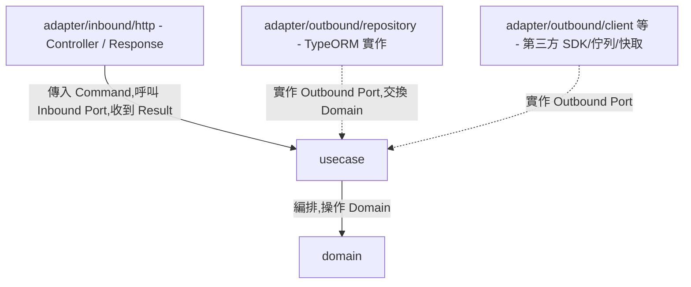

# Architecture — 依賴規則、目錄結構與命名推導

所有層共用的規範。產生任何程式碼前先讀本文件。

## 規則

1. 依賴方向由外向內:`adapter`(Interface Adapters,含 inbound/outbound 兩側)→ `usecase` → `domain`;內層對外層零依賴。
2. Adapter/Outbound 透過「實作 Usecase 的 Outbound Port」與內層連接;Adapter/Inbound 透過「呼叫 Inbound Port」與內層連接——TypeScript 的 `interface` 在編譯後會被完全抹除,執行期不存在,NestJS 的建構子注入靠**執行期 token**(不是型別)決定要注入誰,所以每個 Port 介面旁邊都要同時匯出一個 `Symbol` token(見規則 9),Controller/UseCaseImpl 用 `@Inject(TOKEN)` 取得依賴,而不是單靠型別。
3. 所有目錄路徑與型別名稱依本文件的結構與推導表產生。
4. 專案根目錄一律是 `src/`(未特別指定時);TypeScript 用相對路徑 import,不像 Java/Go 有 base package / module path 這種絕對命名空間,因此本 skill 不需要詢問「package 名稱」,只需要確認 `src/` 之下要不要有額外的專案子目錄前綴(通常沒有)。
5. Domain 物件(及其業務方法)只在 `domain`、`usecase`、`adapter/outbound/repository`(Repository Port 本來就是 `save(entity: Booking): Promise<Booking>` 這種簽名,Mapper 也要做 Domain ↔ DataModel 轉換,合理接觸 Domain)之間流動;但**跨到 `adapter/inbound` 一律不行**——Inbound Port 回傳的必須是 Usecase 自己定義的 `<Entity>Result` 家族型別(見 `references/usecase_layer.md` 規則 9),Controller/Response 不 import `domain` 目錄下的任何型別。
6. **一個 use case 情境一個 Inbound Port + 一個 Impl**,不用一個大介面/大 class 涵蓋整個 entity 的所有動作(見 `references/usecase_layer.md` 規則 2、10)。
7. **`<Action>Command` 跟 `<Entity>Result` 一樣定義在 `usecase` 層**(見 `references/usecase_layer.md` 規則 11),不是 Adapter/Inbound 自己的型別——Command 是輸入邊界、Result 是輸出邊界,兩者對稱,都由 Usecase 擁有;Adapter/Inbound 的 Controller 只是 import 使用。
8. 所有跨層方法一律回傳 `Promise<T>`,用 `async`/`await`(TypeORM、NestJS 生態全面基於 Promise);Domain 層方法**不是** async——Domain 是純運算,不做 I/O,回傳值同步取得(對照 Go 版本用 `context.Context` 貫穿,TypeScript 沒有等價機制,不需要額外處理)。
9. **錯誤用 `throw` 表達,不是 Go 那種 `error` 回傳值**:業務規則違反、找不到資料都 `throw` 具名的 Error 子類別,呼叫端用 `instanceof` 判斷種類(對照 Java 版本的例外階層,寫法幾乎一樣,因為 TypeScript 原生支援例外)。
10. Port 介面與其 DI token 一律在同一個檔案匯出:`export interface XxxPort { ... }` 旁邊緊接著 `export const XXX_PORT = Symbol('XxxPort');`,token 命名為介面名稱轉 `SCREAMING_SNAKE_CASE`。這個 token 只用在 `@Inject()` 與 Module 的 `providers` 陣列裡把介面繫結到實作類別,介面本身仍然是型別檢查唯一依據。



## 與 Clean Architecture 四圈的對應

| 本文件層名 | Uncle Bob 原始四圈 |
|---|---|
| `domain` | 第一圈 Entities |
| `usecase` | 第二圈 Use Cases |
| `adapter`(outbound + inbound) | 第三圈 Interface Adapters(Repository 是 outbound 側,Controller/Presenter 是 inbound 側) |
| *(無獨立目錄)* | 第四圈 Frameworks & Drivers — NestJS、TypeORM/DB driver、HTTP server 本身;實務上內嵌於 adapter 層的 decorator 與函式庫呼叫中,不另立目錄 |

## 共用基礎設施(每個專案只生成一次)

跟 Go 版本一樣的道理:TypeScript 沒有 sentinel error,但也不需要每個 entity 各自定義一套「找不到」「驗證失敗」的例外階層——這些概念(狀態不合法、參數不合法、找不到資料、事件發送、Zod 驗證失敗轉 HTTP 狀態碼)在每個 entity 之間完全共用。**下列檔案只在專案第一次使用本 skill 時產生一次,之後每個新 entity 直接重用,不要重複產生**:

```
src/
├── domain/
│   └── errors.ts                          # InvalidStateError、InvalidArgumentError
├── usecase/
│   ├── errors.ts                          # NotFoundError,所有 entity 共用同一個型別
│   └── event-publisher.port.ts            # DomainEventPublisher 介面 + token(所有 entity 共用同一個 Port)
└── adapter/
    ├── outbound/event/
    │   └── nest-event-publisher.adapter.ts # DomainEventPublisher 的唯一實作,底層用 @nestjs/event-emitter
    └── inbound/http/
        ├── pipes/zod-validation.pipe.ts    # 把 Zod schema 包成 Nest PipeTransform
        └── filters/global-exception.filter.ts # 全域錯誤轉 HTTP 狀態碼
```

`DomainEventPublisher` 在 Java/Go 版本裡是每個 entity 各自在 `usecase/<entity>/port/` 下重新宣告一份(雖然結構完全相同);TypeScript 版本改成全專案共用同一份介面與 token,理由是:Nest 的 DI token 要精確匹配才能注入,per-entity 各自宣告一份結構相同的介面在 TS 裡只會讓 Module 的 `providers` 繫結多出重複的 token 名稱可以維護,沒有 Go 那種「package 邊界天然隔離」的好處,所以直接共用更省事、也更少出錯。

### `src/domain/errors.ts`

```typescript
export class InvalidStateError extends Error {
  constructor(message: string) {
    super(message);
    this.name = 'InvalidStateError';
  }
}

export class InvalidArgumentError extends Error {
  constructor(message: string) {
    super(message);
    this.name = 'InvalidArgumentError';
  }
}
```

### `src/usecase/errors.ts`

```typescript
export class NotFoundError extends Error {
  constructor(
    readonly entity: string,
    readonly id: unknown,
  ) {
    super(`${entity} not found for id: ${String(id)}`);
    this.name = 'NotFoundError';
  }
}
```

### `src/usecase/event-publisher.port.ts`

```typescript
export const DOMAIN_EVENT_PUBLISHER = Symbol('DomainEventPublisher');

export interface DomainEventPublisher {
  publish(event: unknown): Promise<void>;
}
```

### `src/adapter/outbound/event/nest-event-publisher.adapter.ts`

```typescript
import { Injectable } from '@nestjs/common';
import { EventEmitter2 } from '@nestjs/event-emitter';
import { DomainEventPublisher } from '../../../usecase/event-publisher.port';

@Injectable()
export class NestDomainEventPublisherAdapter implements DomainEventPublisher {
  constructor(private readonly eventEmitter: EventEmitter2) {}

  async publish(event: unknown): Promise<void> {
    if (event === null || event === undefined) return;
    this.eventEmitter.emit(event.constructor.name, event);
  }
}
```

用 `event.constructor.name`(如 `BookingConfirmedEvent`)當發送的事件名稱,讓監聽端可以用 `@OnEvent('BookingConfirmedEvent')` 訂閱,不需要每個事件額外定義一個字串常數。使用這個 adapter 的專案要在 `AppModule` 的 `imports` 加上 `EventEmitterModule.forRoot()`(`@nestjs/event-emitter` 套件),這個 skill 不產生 `AppModule` 本身,只在第一次產生本檔案時提醒使用者。

### `src/adapter/inbound/http/pipes/zod-validation.pipe.ts`

```typescript
import { Injectable, PipeTransform } from '@nestjs/common';
import { ZodSchema } from 'zod';

@Injectable()
export class ZodValidationPipe implements PipeTransform {
  constructor(private readonly schema: ZodSchema) {}

  transform(value: unknown): unknown {
    return this.schema.parse(value);
  }
}
```

`schema.parse` 驗證失敗時丟出 `ZodError`,不在這裡攔截轉換——統一交給 `GlobalExceptionFilter` 處理(規則見下方),Pipe 本身保持單一職責。

### `src/adapter/inbound/http/filters/global-exception.filter.ts`

```typescript
import {
  ArgumentsHost,
  Catch,
  ExceptionFilter,
  HttpException,
  HttpStatus,
} from '@nestjs/common';
import { Response } from 'express';
import { ZodError } from 'zod';
import { InvalidArgumentError, InvalidStateError } from '../../../../domain/errors';
import { NotFoundError } from '../../../../usecase/errors';

@Catch()
export class GlobalExceptionFilter implements ExceptionFilter {
  catch(exception: unknown, host: ArgumentsHost): void {
    const response = host.switchToHttp().getResponse<Response>();

    if (exception instanceof NotFoundError) {
      response.status(HttpStatus.NOT_FOUND).json({ error: exception.message });
      return;
    }
    if (exception instanceof ZodError) {
      const message = exception.issues[0]?.message ?? 'Validation failed';
      response.status(HttpStatus.BAD_REQUEST).json({ error: message });
      return;
    }
    if (exception instanceof InvalidStateError || exception instanceof InvalidArgumentError) {
      response.status(HttpStatus.BAD_REQUEST).json({ error: exception.message });
      return;
    }
    if (exception instanceof HttpException) {
      response.status(exception.getStatus()).json({ error: exception.message });
      return;
    }
    response.status(HttpStatus.INTERNAL_SERVER_ERROR).json({ error: 'Internal server error' });
  }
}
```

第四個分支(`HttpException`)接住 Nest 內建 Pipe(如 `ParseIntPipe` 剖析路徑參數 `:id` 失敗)丟出的例外,讓它們照自己原本的狀態碼回應,不會掉到最後的 500——這是 Java/Go 版本沒有的分支,因為框架內建的驗證錯誤在那兩個語言裡不會混進 Controller 這層。這個檔案要在應用啟動時全域註冊一次(`app.useGlobalFilters(new GlobalExceptionFilter())`,通常寫在 `main.ts` 的 `bootstrap()`),這個 skill 不產生 `main.ts` 本身,只在第一次產生本檔案時提醒使用者手動加上這一行。

## 目錄結構

```
src/
├── domain/
│   ├── errors.ts                                # 共用,見上節
│   └── <entity>/
│       ├── <entity>.ts                          # 核心領域實體
│       ├── <entity>-status.ts                   # 狀態列舉(如適用)
│       └── <concept>.ts                         # 策略介面(如適用)
│
├── usecase/
│   ├── errors.ts                                # 共用,見上節
│   ├── event-publisher.port.ts                  # 共用,見上節
│   └── <entity>/                                # 一個 use case 情境一個檔案,直接放在此目錄下
│       ├── <action>-<entity>.usecase.ts          # 如 create-booking.usecase.ts
│       ├── get-<entity>.usecase.ts               # 查詢型 use case,同樣直接放在此目錄下
│       ├── port/                                 # 所有介面(Inbound + Outbound Port,除了共用的 DomainEventPublisher)
│       │   ├── <action>-<entity>.usecase-port.ts # Inbound Port,一個 use case 情境一個(回傳 Result,不回傳 Domain)
│       │   ├── <entity>.repository.ts            # Outbound Port — 資料庫抽象
│       │   ├── <concept>.client.ts                # Outbound Port — 外部 API/SDK 抽象(如適用)
│       │   ├── <concept>.message-publisher.ts     # Outbound Port — 訊息佇列抽象(如適用)
│       │   ├── <concept>.cache-store.ts           # Outbound Port — 快取抽象(如適用)
│       │   ├── <concept>.notification-sender.ts   # Outbound Port — 通知抽象(如適用)
│       │   └── <concept>.file-storage.ts          # Outbound Port — 檔案儲存抽象(如適用)
│       ├── result/                               # Usecase 輸出型別(無業務方法)
│       │   ├── <entity>.result.ts
│       │   └── <entity>-summary.result.ts        # 列表/精簡查詢用(如適用)
│       ├── command/                              # Usecase 輸入型別(Zod schema,與 result/ 對稱)
│       │   └── <action>-<entity>.command.ts       # 每個需要 request body 的 use case 一個
│       └── event/
│           └── <entity>-<action>.event.ts        # 領域事件
│
└── adapter/                                       # Interface Adapters(第三圈)
    ├── outbound/                                  # 實作 Outbound Port,驅動內層依賴的一側
    │   ├── repository/
    │   │   ├── datamodel/<entity>.data-model.ts   # TypeORM 持久化物件
    │   │   ├── mapper/<entity>.mapper.ts          # 雙向對映器(static methods)
    │   │   └── <entity>.repository-impl.ts        # Outbound Port 實作
    │   ├── client/<provider>-<concept>.adapter.ts        # 外部 API/SDK(如適用)
    │   ├── messaging/<provider>-<concept>.adapter.ts     # 訊息佇列 producer(如適用)
    │   ├── cache/<provider>-<concept>.adapter.ts         # 快取讀寫(如適用)
    │   ├── notification/<provider>-<concept>.adapter.ts  # 通知發送(如適用)
    │   ├── storage/<provider>-<concept>.adapter.ts       # 檔案/物件儲存(如適用)
    │   └── event/nest-event-publisher.adapter.ts         # 共用,見上節
    │
    └── inbound/
        └── http/
            ├── <entity>/
            │   ├── <entity>.controller.ts         # @Controller,import usecase 層的 <Action>Command
            │   ├── <entity>.response.ts            # 輸出
            │   └── <entity>.module.ts               # @Module,組裝這個 entity 的所有 provider/token 繫結
            ├── pipes/zod-validation.pipe.ts        # 共用,見上節
            └── filters/global-exception.filter.ts  # 共用,見上節
```

## 命名推導表(Entity = `Booking` 為例)

| 概念 | 型別/識別符 | 檔案路徑 |
|---|---|---|
| Domain 實體 | `class Booking` | `src/domain/booking/booking.ts` |
| Domain 狀態列舉 | `enum BookingStatus` | `src/domain/booking/booking-status.ts` |
| Domain 策略介面 | `interface <Concept>` | `src/domain/booking/<concept>.ts` |
| UseCase Inbound Port(一個 use case 一個) | `interface CreateBookingUseCase` + `const CREATE_BOOKING_USE_CASE` | `src/usecase/booking/port/create-booking.usecase-port.ts` |
| UseCase 實作(一個 use case 一個) | `@Injectable() class CreateBookingUseCaseImpl` | `src/usecase/booking/create-booking.usecase.ts` |
| UseCase 輸出型別(detail) | `class BookingResult` | `src/usecase/booking/result/booking.result.ts` |
| UseCase 輸出型別(summary/list) | `class BookingSummaryResult` | `src/usecase/booking/result/booking-summary.result.ts` |
| UseCase 輸入型別(command,Zod) | `const CreateBookingCommandSchema` + `type CreateBookingCommand` | `src/usecase/booking/command/create-booking.command.ts` |
| Outbound Port — DB | `interface BookingRepository` + `const BOOKING_REPOSITORY` | `src/usecase/booking/port/booking.repository.ts` |
| Outbound Port — 外部 API/SDK | `interface <Concept>Client` + token | `src/usecase/booking/port/<concept>.client.ts` |
| Outbound Port — 訊息佇列 | `interface <Concept>MessagePublisher` + token | `src/usecase/booking/port/<concept>.message-publisher.ts` |
| Outbound Port — 快取 | `interface <Concept>CacheStore` + token | `src/usecase/booking/port/<concept>.cache-store.ts` |
| Outbound Port — 通知 | `interface <Concept>NotificationSender` + token | `src/usecase/booking/port/<concept>.notification-sender.ts` |
| Outbound Port — 檔案儲存 | `interface <Concept>FileStorage` + token | `src/usecase/booking/port/<concept>.file-storage.ts` |
| 領域事件 | `class BookingConfirmedEvent` | `src/usecase/booking/event/booking-confirmed.event.ts` |
| TypeORM DataModel | `@Entity('bookings') class BookingDataModel` | `src/adapter/outbound/repository/datamodel/booking.data-model.ts` |
| Mapper | `class BookingMapper`(static `toDomain`/`toDataModel`) | `src/adapter/outbound/repository/mapper/booking.mapper.ts` |
| Repository 實作 | `@Injectable() class BookingRepositoryImpl` | `src/adapter/outbound/repository/booking.repository-impl.ts` |
| 外部依賴 Adapter(client/messaging/cache/notification/storage 共用) | `@Injectable() class <Provider><Concept>Adapter` | `src/adapter/outbound/client/stripe-payment.adapter.ts` |
| Controller | `@Controller('api/bookings') class BookingController` | `src/adapter/inbound/http/booking/booking.controller.ts` |
| Response | `class BookingResponse` | `src/adapter/inbound/http/booking/booking.response.ts` |
| Module(組裝 DI) | `@Module({...}) class BookingModule` | `src/adapter/inbound/http/booking/booking.module.ts` |
| Domain aggregate test(Layer 1) | `describe('Booking...')` | `src/domain/booking/booking.spec.ts` |
| Controller-level 整合測試(Layer 2,testcontainers) | `describe('BookingController (e2e)...')` | `src/adapter/inbound/http/booking/booking.controller.e2e-spec.ts` |

檔名一律 kebab-case、副檔名依 NestJS/Nest CLI 慣例加後綴(`.controller.ts`、`.module.ts`、`.usecase.ts` 等);單元測試用 `.spec.ts`、e2e 測試用 `.e2e-spec.ts`,對應 Vitest 預設的 test glob。

## 輸入格式

```
Entity: <實體名稱,PascalCase>
Fields:
  - <fieldName> (<TypeScript 型別>) [<說明,選填>]
Business Rules:
  - <methodName>(): <業務規則描述>
Outbound Dependencies:
  - <InterfaceName>: <用途說明>
API Endpoints:
  - <HTTP Method> <path>: <說明>
Tests: (選填 — 提供時先產測試再產實作)
  - <測試情境描述>
```
